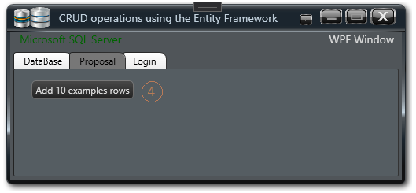

# WPF Core: Entity Framework with SqlServer and MVVM

The application demonstrates the use of Entity Framework to perform CRUD operations on a Microsoft SQL Server database.  
Application uses the MVVM pattern.
Application uses my "nice" WPF windows (see: https://github.com/janluksoft/WPFCoreNiceWin).

The structure of the table is defined by the POCO (CPerson) class. The class (PeopleDBContext) creates a context (dbPersons) that represents a table (Sprinters) in the form of an object. Operations on this object are automatically transferred to the table (Sprinters) in the database.

## Details

- Environment: VS2019
- Target: .NET5 (.NET Core)
- Window: WPF
- Pattern: MVVM
- Tests: unit and integration

## Using the application

- On the (Login) tab, enter the login information from SQL Server
- Check the connection with the button 2 (Check Connection)
- For valid data, a message will be shown: (Connection Good)

- In the (Proposal) tab, press the (4) button. The application should automatically create a table (Sprinters) on SQL Server

- In the (DataBase) tab you can: (5) read the table from the SQL server, (6) add rows, (7) delete rows. 

## Tests in application

The application also includes two test projects: 1) unit test (TestProject) 2) integration test (TestProjectIntegration). 
They both perform an action on the database using the Entity Framework. The integration test additionally uses transaction 
classes for the database to reverse test operations.

Below are the test results:

